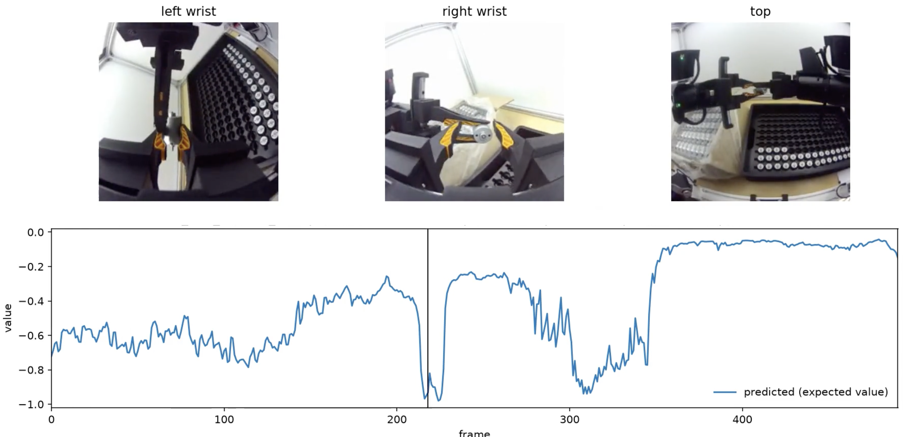
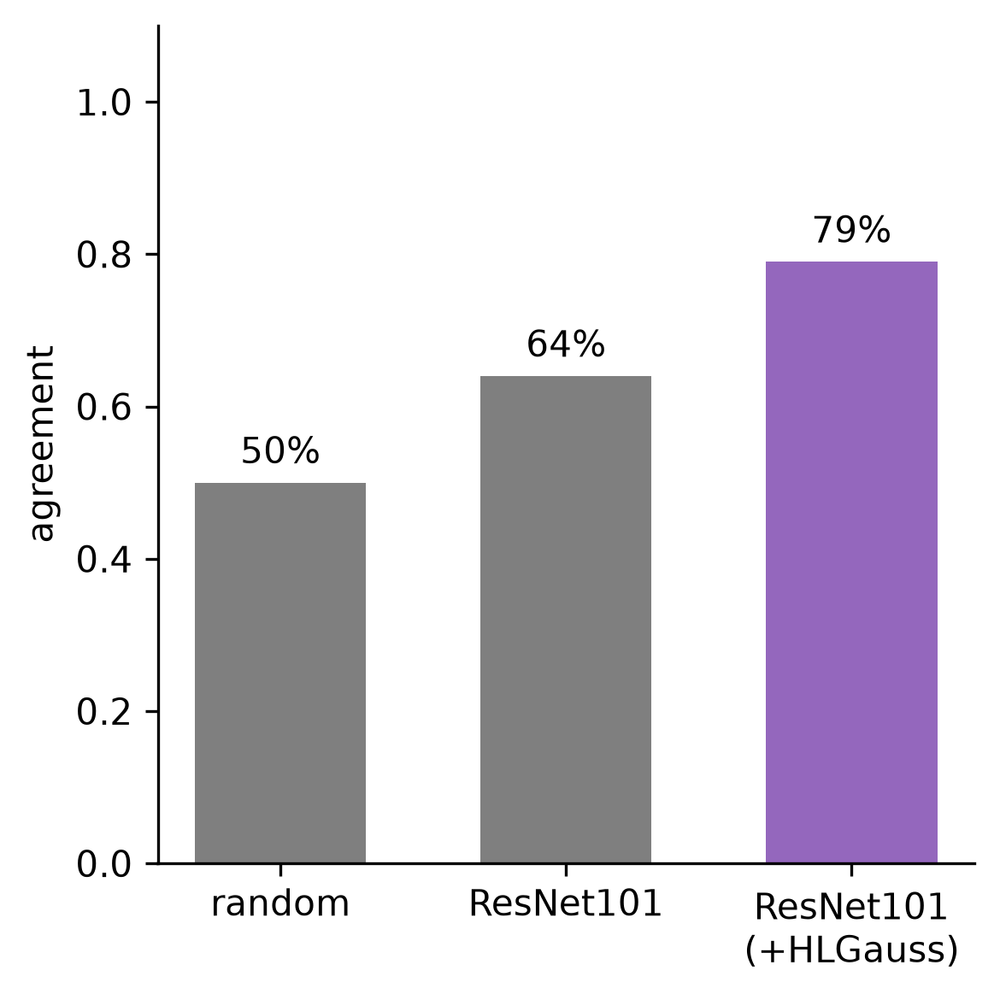

# Learning Distributional Value Functions

Robot rollouts are easy to collect, but they usually come with a single binary label: whether the episode succeeded or failed. This project learns a dense, frame-level value function from such data, so that every state of every rollout, failed ones included, gets an estimate of how close it is to a quick success. The difference in value between two states gives the advantage of the actions in between, which can be used to exploit suboptimal data during VLA training, as done in π\*0.6 [1].

We work on an actuator unboxing task, using the [`20h_fullft_eval_success`](https://huggingface.co/datasets/DreamMachines/20h_fullft_eval_success) dataset (800 rollouts, roughly half successful). Each observation is a set of three frames (left wrist, right wrist, top camera), and the model predicts the value of that state.

The binary outcome is turned into a dense reward. For an episode of length $T$, the reward at step $t$ is

```math
r_t =
\begin{cases}
0 & \text{if } t = T \text{ and success} \\
-C & \text{if } t = T \text{ and failure} \\
-1 & \text{otherwise}
\end{cases}
```

where $C$ is a large constant. The value target of each frame is its return-to-go, normalized to $[-1, 0]$, so the value is higher for states closer to a quick success.

Instead of regressing the value directly, the model predicts a distribution over discretized value bins and is trained with cross-entropy against HL-Gauss soft targets [3]. The architecture is a ResNet-101 [2] backbone that encodes each frame independently. The features are then concatenated and fed to a two-layer GELU MLP that predicts the logits for the bins.

<p align="center">
  
</p>

**Figure 1: Value along an episode.** *Predicted value over a successful validation episode. When the policy fails to grasp the actuator, the value drops sharply; once it recovers with a correct grasp, the value rises again.*

<p align="center">
  
</p>

**Figure 2: Human agreement with predicted advantages.** *An annotator watches two intervals from the same episode, and picks the one that went better. Agreement is how often that pick matches the interval with the higher predicted advantage. Random is chance (50%). ResNet101 is trained with one-hot cross-entropy, and +HLGauss uses soft targets with σ = 0.75.*

> **Disclaimer:** these are preliminary results. Each model was scored on only 14 annotated pairs.

## Repository Structure

```
├── configs/      # Hydra configs
├── src/          # data module, models, trainer
├── scripts/      # train.py, test.py, annotate.py
├── notebooks/    # data exploration, evaluation, loss analysis
├── dump/splits/  # fixed train/val/test episode splits
├── data/         # datasets (git-ignored)
└── checkpoints/  # trained models (git-ignored)
```

A presentation of this work is available in [the slides](dump/slides.pdf).

## References

1. Physical Intelligence. [π\*0.6: a VLA That Learns From Experience](https://arxiv.org/abs/2511.14759). arXiv:2511.14759, 2025.
2. K. He, X. Zhang, S. Ren, J. Sun. [Deep Residual Learning for Image Recognition](https://arxiv.org/abs/1512.03385). CVPR, 2016.
3. J. Farebrother et al. [Stop Regressing: Training Value Functions via Classification for Scalable Deep RL](https://arxiv.org/abs/2403.03950). ICML, 2024.
